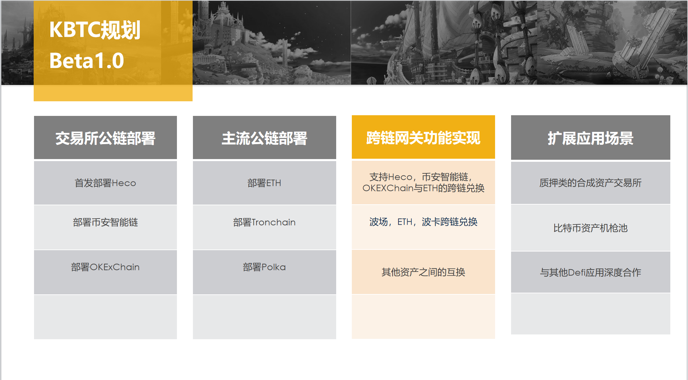

## KBTC's vision and plan

KBTC is a one-to-one cross-chain algorithmic stablecoin that anchors BTC. It is the world's first algorithmic stablecoin that combines AMPL mechanism with BASIS.
KBTC will become a world-renowned cross-chain asset because of its innovative algorithmic stablecoin mechanism. It is more decentralized, more objective and fair than RBTC and wBTC, and even lower premium or volatility. KBTC will have stronger stability:

We will deploy on Ethereum, TRON, Polkadot and other public chains, and develop a cross-chain gateway to make KBTC an algorithmic stable currency that can be cross-chain.

And continue to implement its own ecology and reach in-depth cooperation with the world's top Defi applications.

## **KBTC's rebase and bond mechanism**

KBTC is a one-to-one cross-chain algorithmic stablecoin that anchors BTC. It is the world's first algorithmic stablecoin that combines AMPL mechanism with BASIS.

#### The rebase mechanism of the board of directors

Rebase every 12 hours, 20% each time, totaling 40% per day. Rebase is triggered when the 12-hour weighted average price of the conversion ratio of KBTC to BTC is higher than 1:1.05. 40% of the total amount of each rebase is to be repaid first, and the remaining 60% is still issued through the board of directors. The remaining outstanding debts are continuously repaid during each rebase.

#### Deflationary combustion mechanism

When the 12-hour weighted average price shows that the exchange ratio of KBTC to BTC is lower than 0.95, the global combustion mechanism is activated, and 5% of the currency is burned. Theoretically, the exchange ratio of KBTC to BTC will instantly return to 1:1. Anyone can open the interface. Can burn. The 0.95-1 range still gives bonds a controllable arbitrage space, and the recovery of the remaining price depends on the user's consensus on price increases to drive the purchase of bonds. Only one burning can be carried out every 12 hours. When burning, the debt balance will not burn.

#### Debt mechanism

When the hourly weighted average price and the conversion ratio of KBTC to BTC are lower than 0.95, users can exchange KBTC for bond KB for arbitrage. The minimum price of KB exchanged for KBTC is set at: 0.95 square = 0.9025. Using KBTC to exchange bond KB can avoid global burning. In order to avoid burning deflation, users can choose to exchange bonds at this time for currency-based preservation.

#### Matters needing attention

In order to realize the global burning function, after the board of directors issues additional KBTC, users need to receive the board's proceeds to their wallet before the 12-hour weighted average price falls below 0.95. Otherwise, when the burning is triggered, the HBTC rewards not received in the board of directors will be cleared.

In addition, every time you pledge or decompress KS in the board of directors, you will automatically receive the KBTC of the board's income to your wallet. Please check the wallet balance.

