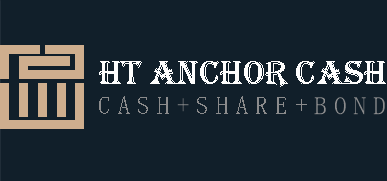
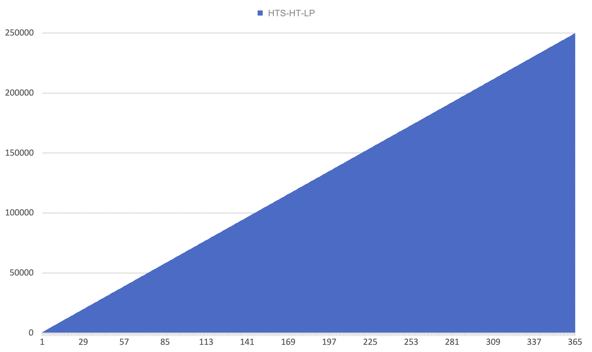
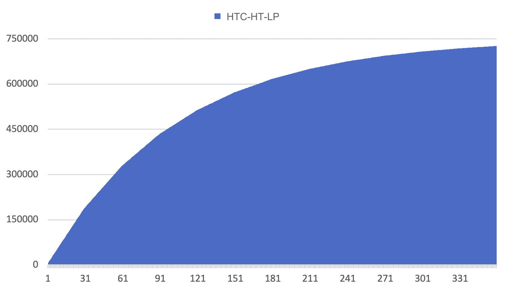
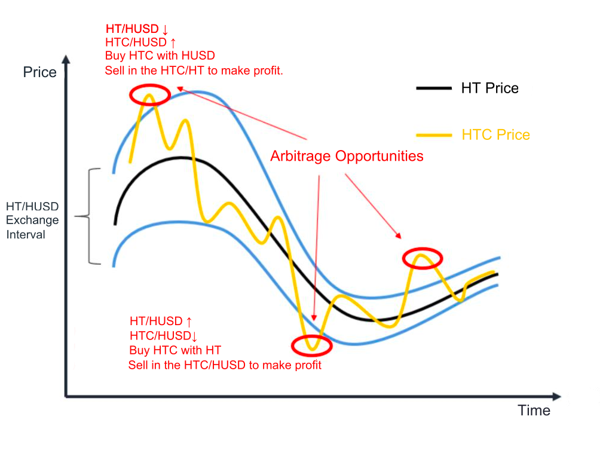

# HTC.CASH-The first Algorithm Stablecoin pegged to HT on Heco Chain

When it comes to pegging digital assets to the price of specific goods or services, undercollateralized algorithmic stablecoins have always been the holy grail pursued by all teams. Fundamentally speaking, the stability of these assets is completely driven by the market supply and demand mechanism and a reasonable token model. The optimized combination will eventually push the price to an ideal state.

Huobi Token (HT) is the basic asset on the Huobi Ecological Chain (HECO), and with the continuous development of the HECO ecosystem, a digital asset that pegged to HT will inevitably be needed to meet the growing demand for transactions. On the one hand, the transaction is completed on HECO. Compared with the high GAS fee on the ETH chain, the transaction fee on HECO is lower and speed is faster. On the other hand, digital assets pegged to the US dollar and gold will depreciate with the inflation of anchors, and the total amount of HT is constant, so there is no devaluation problem.

Here, we propose an experimental innovative stablecoin project: **HT ANCHOR CASH**, which pegged to HT and is an improved version of Basis Protocol. The main improvements are as follows:

- The price feeding mechanism is based on the 12-hour weighted average price of the HT-HTC trading pair on the decentralized exchange to reduce the risk of price manipulation;
- The time of Rebase is adjusted to once every 12 hours, at 8:00 and 20:00 SGT respectively;
- The additional issuance number of tokens for each rebase period is adjusted to: 95% of the total distribution of each rebase, and the other 5% goes to the treasury instead of the original 100% on Basis Protocol. The adjustment here can make the treasury more profitable and compulsorily redeem HTB Bonds, when the price of HTC is lower than 1 HT, it will better encourage users to exchange bonds and maintain balance.
- The transaction price of stablecoins within a certain minting time reaches 1.1 HT (not the original 1.05), and additional issuance will be carried out to strengthen the stability of the additional issuance rate;
- Extend stablecoin mining time, support more HRC20 currency mining, and strengthen consensus.

# **HT ANCHOR CASH tokenomics**

There are three kinds of tokens in the HT ANCHOR CASH protocol, namely HTC (HT ANCHOR CASH), HTS (HT ANCHOR CASH Share) and HTB (HT ANCHOR CASH Bond). HTC and HTS can be obtained by providing liquidity, among which HTC is pegged to HT value to 1 HT (HTC:HT=1:1). HTS holders can participate in board staking to obtain the premium income generated by HTC after inflation. The board of directors will be opened 4 days after the project is opened. HTB is a bond issued when the price of HTC is less than 1 HT and can be used to repurchase HTC. When price of HTC exceeds 1.1 HT, HTB holders can exchange HTC back at ratio of 1:1.

# **HT ANCHOR CASH stabilization mechanism**

The HT ANCHOR CASH protocol will set a threshold for token price stability, and the stability mechanism will be triggered when it is above or below this threshold.

**When HTC is below 1 HT**

When HTC is traded below 1 HT, users will be able to purchase HTB at a certain discount to establish the price stability of HTC, with the expectation of future profits upon redemption.

Each bond promises the holder exactly 1 HTC at some point in the future under certain conditions. Whenever a user purchases HTC, it is burned, causing a decrease in the circulating cash supply. Bonds do not have interest payouts, nor do they have maturity or expiration dates. Rather, they can be redeemed on a 1:1 ratio with HTC when the price rises above 1.1 HT.

Purchased bonds can be redeemed on a 1:1 ratio with cash only when the oracle price of cash is above 1.1 HT. This prevents bondholders from cutting their losses on redemptions and creating unnecessary increases in supply.

**When HTC exceeds 1.1 HT**

If the price of HTC exceeds 1.1 HT, bond redemptions will be triggered. If the price of HTC is still traded above 1.1 HT even after bonds are redeemed, new HTC will be minted resulting from the increasig demand and will be fairly distributed to HTS holders.

# **Token distribution plan**

HTC has no pre-mining, it is fair distribution

HT ANCHOR CASH launches 11 initial mining pools, users can stake **HT, HUSD, HBTC, HETH, HLTC, HBCH, HDOT, HBSV, HFIL**, (assets on Heco)DEX token **RAB** and algorithmic stable token **BAG**, a total of 11 HRC-20 assets to participate in HTC mining.

The total supply of HTC is 11,000. As a reward, it is fairly distributed to each mining pool. Each mining pool can mine 1,000 HTC for 10 days, and each mining pool produces 100 HTC per day.

HTS distribution will begin immediately after HTC starts to distribute, totaling 2,100,001, of which 5% will be allocated to DAO and early investors, also this part will be used for marketing and centralized exchange listing, this part will be unlocked in proportion to the mining output, no pre-mining. 1 HTS as the initial liquidity will be added to the liquidity pool on DEX, 2 million HTS are mined and distributed to 4 mining pools:

- HTC-HT-LP mining pool: 750,000 HTS
- HTS-HT-LP mining pool: 250,000 HTS
- HTC-HUSD-LP mining pool: 750,000 HTS
- HTS-HUSD-LP mining pool: 250,000 HTS

The HTS-HT-LP mining pool and HTS-HUSD-LP mining pool will distribute the same number of tokens every day, that is, 684.9315 HTS, which will be released linearly in one year.

The HTC-HT-LP mining pool and the HTC-HUSD-LP mining pool each release 187,500 HTS in the first 30 days, and decreases 75% after every 30 days

**The key point of the design plan is to make the price linkage between HTC and HT closer, and introduce arbitrage space:**

- When the exchange ratio of HT to HUSD increases, the price of the HTC-HUSD trading pair in the decentralized exchange will appear short-term low. Users can choose to buy HTC with HUSD and sell in the HTC/HT to make profit.
- When the exchange ratio of HT to HUSD drops, the price of the HTC-HUSD trading pair will have a short-term high price. Users can choose to buy HTC with HT in the HTC-HT trading pair and sell in the HTC/HUSD to make profit

# **Join the community and participate in governance**

The launch of HT ANCHOR CASH on HECO is a great recognition of HECO’s leading position in the DeFi industry. Here, we invite every participant and user in Huobi, HECO and other DeFi ecosystems to participate in the mining and governance of HT ANCHOR CASH. We will definitely become a pivotal player in the DeFi and HECO ecosystem.